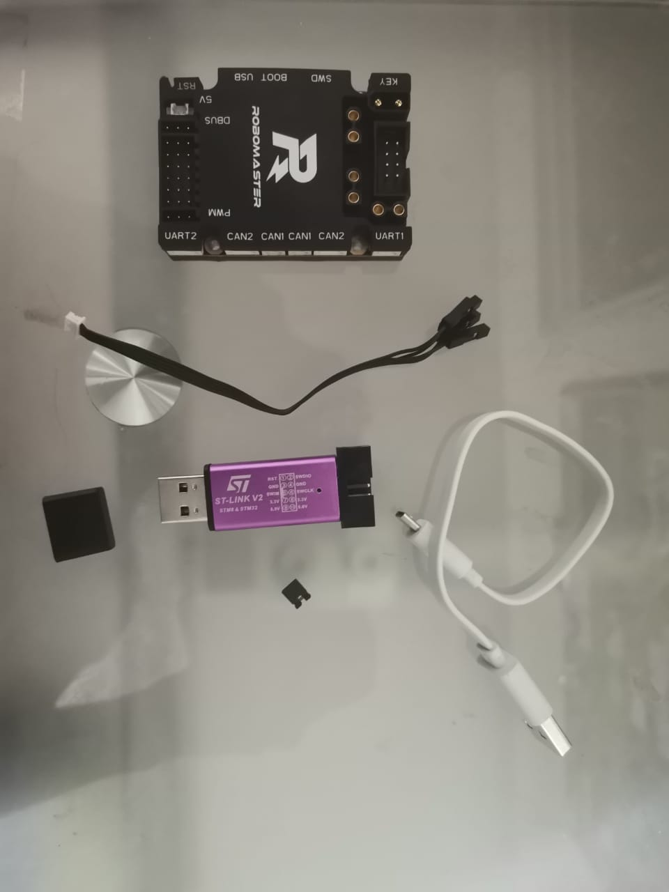
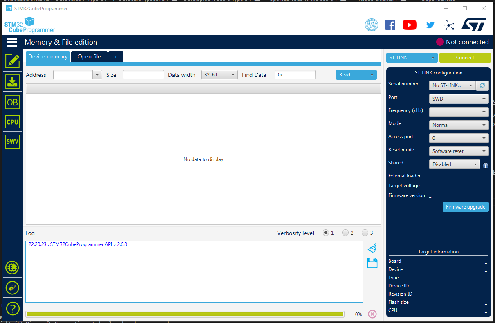

# Development Board Type C

## Quick resume:

* ARM Chip: STM32F407. Similar to: Cortex™-M4 core.
* STMicrochips product information: https://www.st.com/en/microcontrollers-microprocessors/stm32f407-417.html
* UserProgram.bin was downloaded from RM official Site, By the name of *RoboMaster Development Board Type C Factory Program*.

    Note: There is a difference in uploading code and updating firmware for the DevBoard. Firmware is more like a a BIOS, it's a bootloader, the actual robot code is an application. 

## Update Board:
1. Download the User guide and read it. It's pretty helpful.
2. Download DfuSe USB from STM32. You can find it here: https://www.st.com/content/st_com/en/products/development-tools/software-development-tools/stm32-software-development-tools/stm32-programmers/stsw-stm32080.html?dl=u9SLTofB1p7OIsW9qyZu%2FA%3D%3D%2CeH28sFQA%2FrE7QayUKkzVBw4Un7FTyVFK%2Fnmd%2FML9SPP74GCo5eiPuKlnpuXTKIv69qqJySdETGnCyspixwSEQiEPdfLHv6VFDG0igHAacd8J5ld6Eji0IpOP3wCb0z7iJQO7uhKfPkzbJ0OvptJJyZsPJLDI%2FFUij8%2FU8FDXcf%2BXsyvYPwGXOu1DybE6FHlPjHRor%2BiycZ42%2B3hsHbAJ%2FkG0wTCj036eejMbDAUoOJiHfi21IQQa55vk2oywk4HEP24GePnP0iNr49QDWTNdIwxJ1dxp2HSJoWcUvn6FjX367ooRhr9Ens3Zy%2F5r1Bg1WJHPg6NilYwjJQ%2BNbdIZTw%3D%3D&uid=ga/fV0anQlqN73qmgbyCGh/D3B5p1C2X
    * DFU will allow you to update the board's firmware. However, we didn't, since we needed a value in the memory to write the program. 
    * To know the version and product's info, connect to STM32CubeProgrammer.

3. Go to RM site
    * Look for your Devboard's site
    * Click on downloads
    * Download the factory program

4. With the help of a jumper, put the board on DFU mode
    * Check remaining instructions at manual.

## Upload code to the board

### Requerements:

#### Materials:

* DevBoard
* ST-LINK/J-LINK debugger: 
    * It was recommended to use this one: https://www.amazon.com/-/es/gp/product/B07SFGSSG8/ref=ox_sc_act_title_1?smid=A2K5DI8VX12AN1&psc=1 
* SWD -> 4 pin cable
* Jumper
* USB cable (Micro/C)

#### Dependencies
* Arm Toolchain Compiler
    * https://developer.arm.com/tools-and-software/open-source-software/developer-tools/gnu-toolchain/gnu-rm/downloads
    * It's of my understanding that MDK-ARM V# is an alternative. Downloaded with µKeil IDE

* ST-LINK drivers to upload code to the card
    * https://www.st.com/content/st_com/en/products/development-tools/software-development-tools/stm32-software-development-tools/stm32-utilities/stsw-link009.html?dl=U97wBPSuADPfvMbPmuPsgw%3D%3D%2Cpd4ctPjSTT%2FAQPd%2F1pTlnwB3h2%2BlWZJDglm0HPZSiwunBLHVBumTakYkDUJ7Q9Q59Bw%2BzkSTGKWdA7qTJtk9AO4cjRsJ3M7%2FEDPgz7sVre%2BE54%2BufDBAlAxhJJx0tfepas2OE0uq88vw9QZziJwSO5G9cXkdF3O6hzXscGvNn3t4O14%2BRWXd22Y6QM8DqILCDz%2FXAU4rTalknePsNbd748yivGyfG24cKIU8yzAKZDHjPl19v1YbzaTc6J4ys5mG4fF%2FF2jNt4I8KvQNog0eYOD2%2BmCxTfaYR1QyoJK30HtgMdB5Ia3UA4LcBAonpRIr&uid=ga/fV0anQlqN73qmgbyCGh/D3B5p1C2X

* STM32CubeProgrammer
* STM32CubeMX
* STM32IDE (Can save you a lot of time when installing packages, but I still don't know how to use it :D)

* Make sure the ST-Link/J-Link firmware is updated  (USB stick or box). 
    * Check for configuration settings: https://www.st.com/resource/en/user_manual/cd00262073-stm32-stlink-utility-software-description-stmicroelectronics.pdf
    * You'll probably get "DEV_USB_COMM_ERR" if not done
    * To update the firmware:
        * Make sure you have the latest drivers from ST-Link installed
        * Open STM32CubeProgrammer
        * Connect USB stick
        * Select ST-Link on the right panel
        * Click on update firmware
        * Don't worry if at the end, device connetion gets lost. It worked just fine to me :D
    * You'll now it's ready once you get the same result from connecting the board with a USB cable or through the debugger

* Free tools to burn (upload) the code onto the board:
    * STLINK: https://github.com/stlink-org/stlink
    * Install on Windows: https://github.com/stlink-org/stlink/blob/develop/doc/compiling.md#Windows

* OpenOCD: http://openocd.org/getting-openocd/ 
    * Necesary to debug

* Install mingw-w64 paramerters from installer: https://stackoverflow.com/questions/29947302/meaning-of-options-in-mingw-w64-installer
    * https://sourceforge.net/projects/mingw-w64/

* Firmware Package: TODO: research