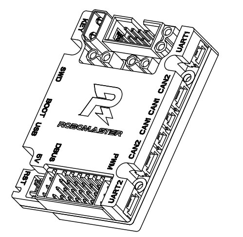

# Resumen de como sirve el DevBoard tipo C

### Tiene las siguientes conecciones (que considero importante):

1. `Power in`, tiene que venir del referee system, es el que esta grande (24 Volts)
1. `Power out` Son los que estan a un lado del power in, son 3, y don 24V, tambien hay uno de 5V abajo.
1. Los `pines` que estan a un lado del powerport, son pines que puedes tener como costum I/O
1. 7 `PWM`
1. `USB` para conectar perifericos
1. `SWD`, para actualizar firmware
1. Tiene 2 puertos de `CAN`, aunque parezcan 4, para que tengamos un ligar donde cerrar el CAN
1. Donde dice RST es para reiniciar el board
1. El boton `KEY` es para hacer costumizarion
1. En la parte de atras, tiene puerto para camara
1. RGB LED que podemos usar para lo que queramos

Guias bajo `Embedded Systems/DevBoards/Type C/RoboMaster Development Board Type C Schematic Diagram & Symbol Diagram` o en https://www.robomaster.com/en-US/products/components/general/development-board-type-c#downloads junto a FAQ

Deje el default program que proporciona Robomaster en la misma carpeta, se llama `user_program.bin`. Ese lo podemos usar para primeros auxilios y su primer flasheo. Si lo actualizan, estaran disponibles en la pg web anterior.

# CAN

El board tiene 2 tipos distintos de puertos CAN, uno es de 2 pines, y el otro es de 4, solo se usa uno

# Debugging y extras chidos

## RGB LED, boton costumizable y pines IO

### Pines

En el board, vienen 8 pines que se pueden usar para cosas diversas, recomiendan usar "for connecting an IIC or SPI device"

Los pines son estos:

1|2|3|4|5|6|7|8
:-:|:-:|:-:|:-:|:-:|:-:|:-:|:-:
SPI2_CS|GND|SPI2_CLK|3.3V|SPI2_MOSI|I2C2_SCL|SPI2_MISO|I2C2_SDA

El LED se encuentra en los pines PH10 (Blue),
PH11 (Green), and PH12 (Red). HIGH es prendido, LOW es apagado.

## Buzzer

El board tiene un buzzer interno, que se puede controlar por PWM. 

Creo que esta en `TIM4_CH3`

## Deteccion interna de voltaje

Se puede detectar internamente el nivel de voltaje que entra, checar el User Manual para mas info

## Giroscopio y Magnometro

El board tienen un Giroscopio de 6 axises (2 en cada direccion) y un sensor de tempetarura con un calentador electrico para su mejor operacion encontrados en puertos TIM10_CH1 (corresponding IO is PF6) of the STM32. 

Adicionalmente, el Magnometo contiene 3 direcciones (xyz) para detectar cambio en movimiento, encontrado en puerto STM32 and IST8310 (lo que sea que signifique)

