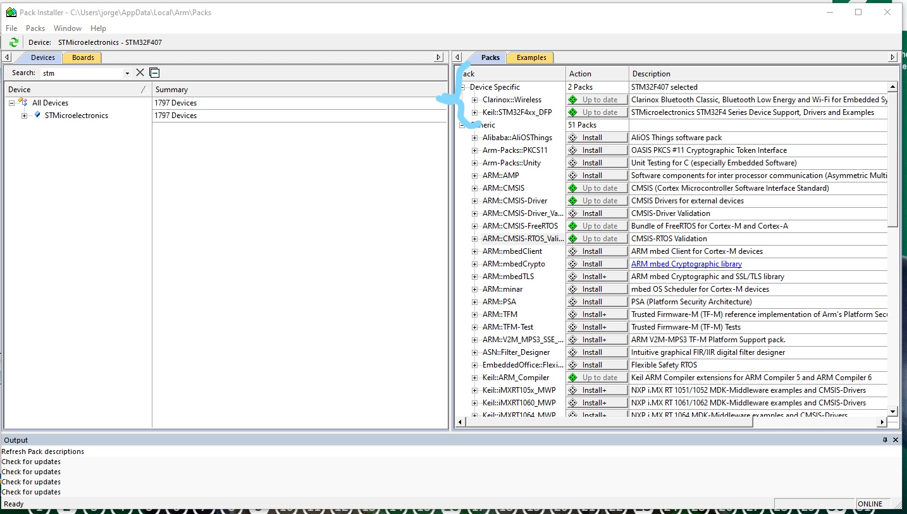

# Guide Embedded Systems

## Set up:
1. Look for the information about the DevBoard you'll be using.
    * ARM Proccesor in it
    * Datasheet for the ARM processor (and it's family)

1. Download ST-LINK V# drivers from: [STM32 site](https://www.st.com/en/development-tools/stsw-link009.html). I believe they are only available on Windows.

1. Download the lattest version of MDK-ARM from [here](https://www.keil.com/download/product/). This will also install uKeil IDE. 
    * If you want to be able to _plug and play_ the code, you should first request a temporary uKeil pro version. 

1. Download the necesary drivers from STM32 *Keil Pack Installer* about your chip's family.
    * You can guide yourself by the images:
    * Open Keil IDE
    * Select Family Installer. As shown in the image
    *  
    * The following window will pop-up 
    *  
    * Look for your device's family on the search bar and download all the packages from "device specific"
    *  

1. The following steps vary depending on whether you have the [uKeil Pro version](UploadCode_Pro_uKeil.md) or [not](UpdloadCode_ARMToolChain.md).
