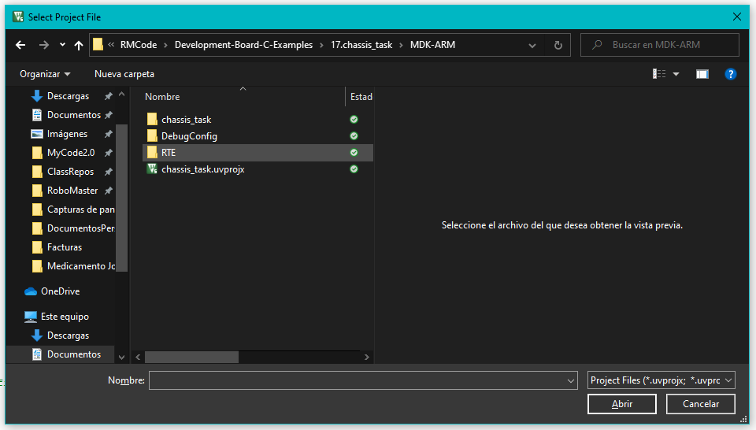
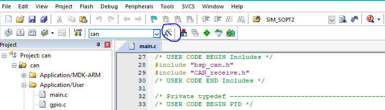
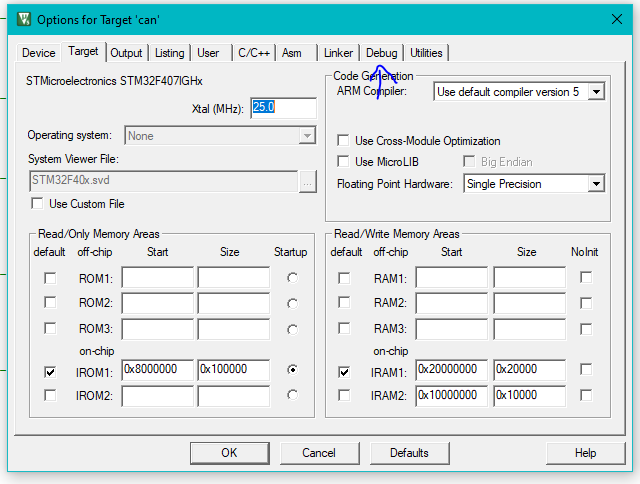
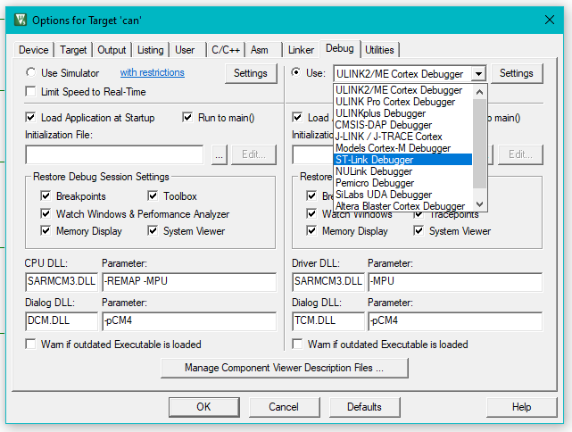
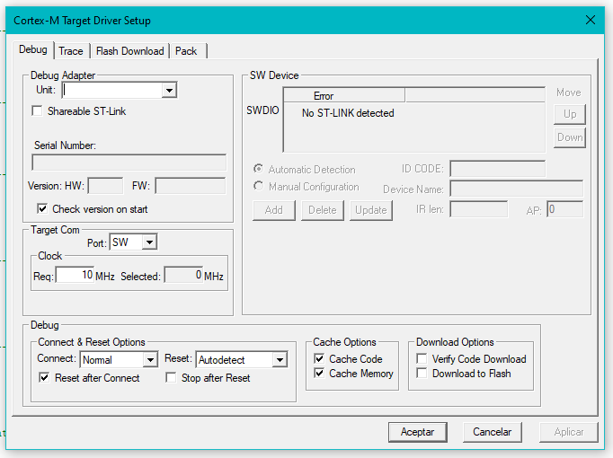
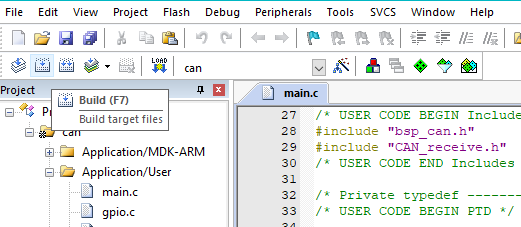

# Upload code to the robot with uKeil Pro version

Before doing any of the following steps, you should the [GuideEmbeddedSystems file](GuideEmbeddedSystems.md).

## Actual steps:
1. Obtain your desired project from Robomaster's or your team's Git. 
1. Open uKeil IDE.
1. On the to left part of the screen:
    * Click project.
    * Open project.
    * Browse your files until you find `something.uvprojx`. It's usually under the MDK-ARM folder (from Robomaster's examples).
    * 
1. Click on the **Magic Wand** from the tools menu.
    * 
    * The following menu will pop-up:
    * 
1. Go to the Debug tab
    *  
    * Select ST-Link Debugger
1. Click on the `settings` button next to it
    * If you intalled correctly ST-Link drivers, and the USB stick is connected to the computer, a device will apear.
    *   
1. Close all menus by saving or clickin ok.
1. Build the project.
    *  
1. Upload it `LOAD`.