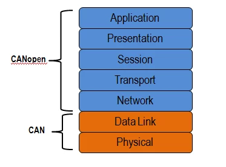
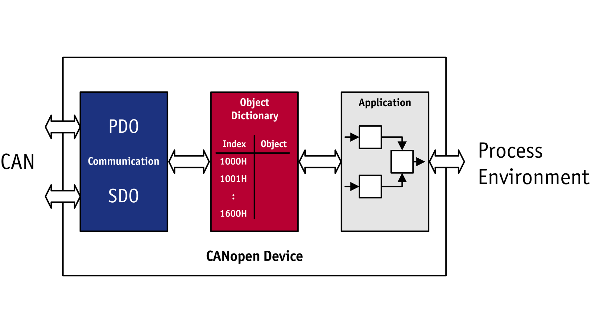
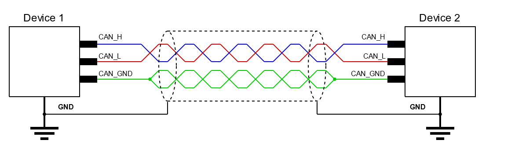
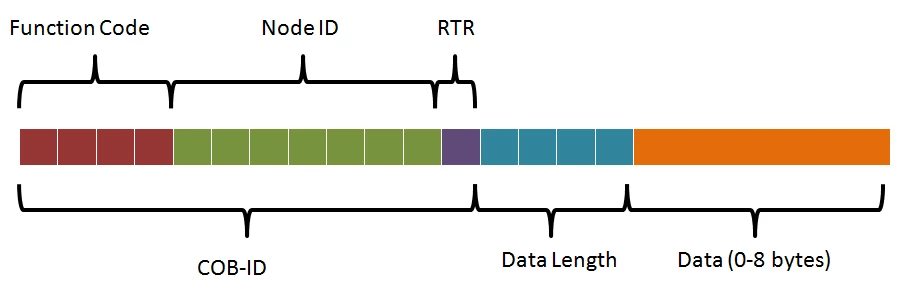

# CAN

[Text Intro](https://www.can-cia.org/can-knowledge/)

[Visual Intro](https://www.youtube.com/watch?v=DlbkWryzJqg)

Is a serial communication protocol that's gained popularity due to it's robustnest against interference and data lost. Broadly used in the industry. Or at least, that's what CAN Bus is, but CAN can be easily undertood from a [ISO model](https://www.can-cia.org/index.php?id=systemdesign-can-physicallayer). 

**Implementation:**

See how the CANOpen device (node), implements PDO and SDO to transmit data with the network. The bits are "reinterpreted" to the Object Dictionary and then finally controlled by application Code. 

--------
## Physical Layer:
CANBus is composed for two cables, CAN Dominant and CAN Recessive, usually refered as CAN_H (High) and CAN_L (low). Along with a common reference between devices. 

Can Bus uses differential signaling, and the difference in voltage across CAN_H and CAN_L is what determines a logical value

[Source](https://danfosseditron.zendesk.com/hc/en-gb/articles/360042232992-CAN-bus-physical-layer)

### CAN Transciever:
The role of the transceiver is simply to drive and detect data to and from the bus. It converts the single-ended
logic used by the controller to the differential signal transmitted over the bus. It also determines the bus logic
state from the differential voltage, rejects the common-mode noise, and outputs a single-ended logic signal to
the controller. Additionally, many transceivers provide features to isolate the controller from bus conditions such
as electrostatic discharge (ESD) or electrical over-stress (EOS) damage, so that a node would be protected if an
extreme bus condition were to destroy the transceiver.
The transceiver distinguishes between two bus logic states, dominant and recessive. A recessive bit is defined
as CAN_H being less than CAN_L+.5V. A dominant bit is defined as CAN_H being more than CAN_L+.9V.
Figure 4-1 illustrates the nominal case. Since dominant bits overwrite recessive bits, CAN manages message
collision through the process of bit-wise arbitration as described earlier.

[Source](https://www.ti.com/lit/an/slla109a/slla109a.pdf)

Note: The source above says CAN should not be connected as a ring network, but from experience, I've seen it work that way. 

--------
## CAN Frame: 
Message send on a CAN Network, the differences between generations are ID length, data bytes, just to name a few. 

It can have different purposes, and such different service indicators. Every service has allocated different word aranges, and purposes, so, be careful when choosing. 
* NMT: Network Management. Control the node state.
* SYNC: Syncronization. Syncrorinez inputs and outputs between the network and the master. 
* EMCY: Emergency. Communicate to all the network a node is failing, along with failure info.
* [PDO](https://www.can-cia.org/can-knowledge/canopen/pdo-protocol): Process Data Object. Transmit real-time data, along with timestamps
* SDO: Service Data Object. Transmit non real-time data
    * SDO recieve (request)
    * PDO transmit (response)
    * Monitoring: periodically check if all the nodes are fine.

**COB-ID:** Communication Object Identifier, a combatin of the Node ID and the function mode. 

### CAN Functions
Function code:
Stabilished the intent of the CAN frame. Each funcition code has several CAN Nodes IDs

### CAN ODS
Object Dictionaries.

A unique attribute for a CAN node (device). It contains entries with device configuration as a standarized structure. I can be accesed by SDO.

Components:
* Index (node ID)
* Object node
* Object code
* Datatype
* Access
* Category

[More on](https://www.can-cia.org/can-knowledge/canopen/device-architecture/)

### CAN EDS
Electronic Data Sheet.
Standaratized file format for ODS. Like a human readable ODS. Template for the OD file. Contains device objects. And service tools to update devices.

Note: The network tool will not connect to a device unless all four identity object parameters match.

[Source](https://www.rtautomation.com/rtas-blog/ethernet-ip-eds-update/#:~:text=Electronic%20Data%20Sheets%20(EDS)%20are,tool%20to%20recognize%20the%20device.)

[How to open an EDS](https://www.lifewire.com/eds-file-2620973)

[EDS Checker](https://www.can-cia.org/services/test-center/eds-checker/)
### CAN DCF:
Device Configuration File.
Like a more complete EDS, with more than generic parameters

### From:
[What are PAL, HAL, CAL?](https://www.linkedin.com/pulse/importance-well-designed-architecture-embedded-software-prajwal-b-v)

[CAN Bus](https://www.csselectronics.com/pages/can-bus-simple-intro-tutorial)

[CAN Open](https://www.csselectronics.com/pages/canopen-tutorial-simple-intro)

[CANOpen Frame](https://www.ni.com/es-mx/innovations/white-papers/13/the-basics-of-canopen.html)

[CAN Terminal Resistor](https://www.csselectronics.com/products/terminal-resistor-can-bus)

[CANOpen Standard](https://www.vector.com/int/en/know-how/protocols/canopen/#c54640)

------

### Go deeper!:
[CAN FD](https://www.csselectronics.com/pages/can-fd-flexible-data-rate-intro)

[CAFOpen & CANFD interoperability](https://www.can-cia.org/fileadmin/resources/documents/proceedings/2013_merkel.pdf)

J1939 protocol

IoT CAN Loggers

[Object Dictionary++](https://www.novantaims.com/downloads/firmware/canopen/object_dictionary.pdf)

[CANOpen DeviceDesigner](https://www.emotas.de/en/produkte/canopen-device-designer)

[Code&Tools](https://www.canopen.us/index.php/links/code-tools-utilities)

Tools:

* [libedssharp](https://github.com/robincornelius/libedssharp)
* [CANOpen Editor](https://github.com/CANopenNode/CANopenEditor)