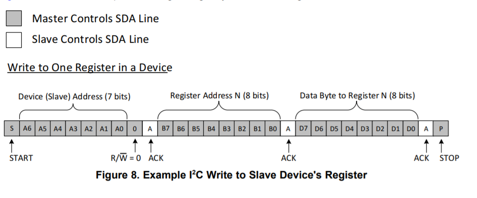
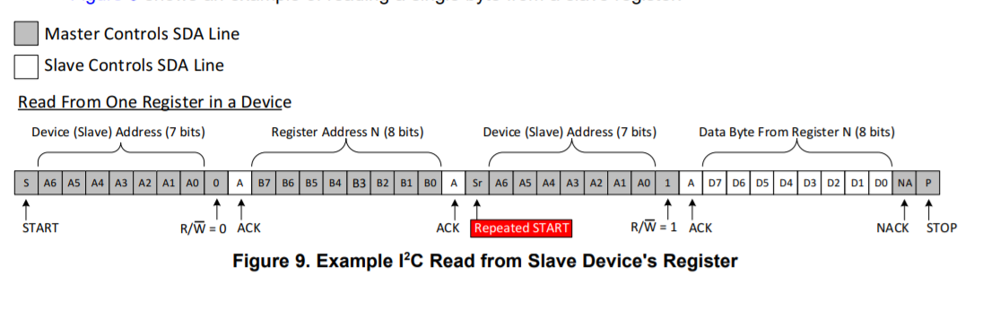

# I2C Communication Protocol

“I2C stands for Inter-Integrated Circuit. It is a bus interface connection protocol incorporated into devices for serial communication. It was originally designed by Philips Semiconductor in 1982. Recently, it is a widely used protocol for short-distance communication. It is also known as Two Wired Interface(TWI).” (2021, GeeksforGeeks)

It uses only 2 bi-directional open-drain lines for data communication called SDA and SCL. Both these lines are pulled high.
I2C uses an open-drain/open-collector with an input buffer on the same line, which allows a single data line to be used for bidirectional data flow.

### Open-Drain for Bidirectional communication 

Open-drain is a type of output  pulls the bus down to a voltage or "release" the bus and let it be pulled up by a pull-up resistor depending on the situation. In the event of the bus being released, the pull-up resistor (RPU) on the line is responsible for pulling the bus voltage up to the power rail. As no other device may force a high on a line, communication issues are unlikely to happen, preventing the salve and master of sending opposite signals through the same lane.

Open-Drain communication is the main benefit of I2C as it does not allow for the master and slave to send contradictory signals that could cause a short. 

### I2C Operation

The physical I 2C interface consists of the serial clock (SCL) and serial data (SDA) lines. Both SDA and SCL lines must be connected to VCC through a pull-up resistor. The size of the pull-up resistor is determined by the amount of capacitance on the I 2C lines (for further details, refer to I 2C Pull-up Resistor Calculation (SLVA689).

The communication is managed by a master who can have more than one slave. A slave does not operate unless its been told by the master. In case the master has more than one slave, the master differentiates each one by its unique register address. Data transfer may be initiated only when the bus is idle. A bus is considered idle if both SDA and SCL lines are high after a STOP condition.

The data is transmitted in the form of packets which comprises 9 bits. The sequence of these bits are :
    
    Start Condition – 1 bit
    
    Slave Address – 8 bit
    
    Acknowledge – 1 bit

#### The general procedure for a master to access a slave device is the following: 

1.	Suppose a master wants to send data to a slave:
    
    Master-transmitter sends a START condition and addresses the slave-receiver 
    
    Master-transmitter sends data to slave-receiver 
    
    Master-transmitter terminates the transfer with a STOP condition 

2.	If a master wants to receive/read data from a slave: 
    
    Master-receiver sends a START condition and addresses the slave-transmitter 
    
    Master-receiver sends the requested register to read to slave-transmitter 
    
    Master-receiver receives data from the slave-transmitter • Master-receiver terminates the transfer with a STOP condition

START and STOP can be generated by keeping the SCL line high and changing the level of SDA. To generate START condition the SDA is changed from high to low while keeping the SCL high. To generate STOP condition SDA goes from low to high while keeping the SCL high.

### Start and Stop Condition

I2C communication with this device is initiated by the master sending a START condition and terminated
by the master sending a STOP condition. A high-to-low transition on the SDA line while the SCL is high
defines a START condition. A low-to-high transition on the SDA line while the SCL is high defines a STOP
condition

### Repeated Start Condition 

Between each start and stop condition pair, the bus is considered as busy and no master can take control of the bus. If the master tries to initiate a new transfer and does not want to release the bus before starting the new transfer, it issues a new START condition. It is called a REPEATED START condition.

### Writing/Reading to/from a salve

The master sends an instruction on the bus with the slave’s address. The last bit of the instruction indicates weather it writes (R/W bit: 0) or it reads (R/W bit: 1).

In case the instruction is to read form a salve, apart from the last bit is followed by the register address it wishes to read from. Once the slave acknowledges this register address, the master will send a START condition again, followed by the slave address with the R/W bit set to 1 (signifying a read). This time, the slave will acknowledge the read request, and the master releases the SDA bus, but will continue supplying the clock to the slave. During this part of the transaction, the master will become the master-receiver, and the slave will become the slave-transmitter.

### I2C Packet Format 

In the I2C communication protocol, the data is transmitted in the form of packets. These packets are 9 bits long, out of which the first 8 bits are put in SDA line and the 9th bit is reserved for ACK/NACK i.e. Acknowledge or Not Acknowledge by the receiver. 

START condition plus address packet plus one more data packet plus STOP condition collectively form a complete Data transfer.

