# Binary, how does it work?

The binary numerical system is of many numerical systems. It is commonly used in computer science and computer development, as its two cyphers allow for making logical comparisons. Apart from this system, the decimal and hexadecimal systems are useful for computer developing. Before explaining with more detail how the binary system works, numerical systems will be briefly introduced and further on the transformations between different systems 

### Numerical Systems 

The decimal numerical system is the one we are most familiar with; we use it in our everyday life and we learn it since we are little. The decimal system, as its name mentions it, is a positional numerical system with base 10, which means it consist of 10 cyphers: 0, 1, 2, 3, 4, 5, 6, 7, 8, 9. A positional system means that depending on the position where the cypher is written it will be assigned a different value, for example:
Take the number 1230 10 (The subindex points out the base in which the number is written)

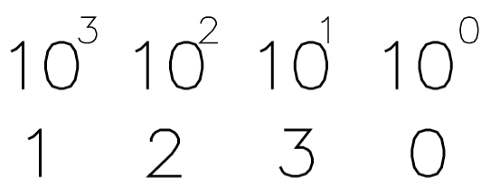

Notice that as the number is written one position further to the left its value increases by 10 (+1). To determine the value of the expression, based on the position of the number, is summed to the other:

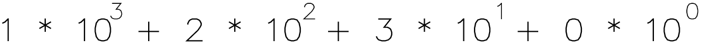
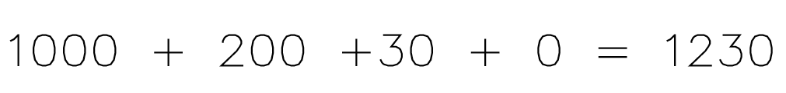

This process might seem natural as we have been using it since we were little. However, there are plenty more numerical systems that are used for different purposes, for example the binary system.

### Binary System

The binary system is a positional numerical system with base 2, which means the system consists only of two cyphers, 0 and 1. In such way that any binary number only contains these two cyphers, for example the numbers: 0001, 0011, 1010.
These numbers may not seem as much at first, therefore, we transform the number to a base 10 number to obtain a more significant expression.

#### Transforming from base 2 to base 10.

As mentioned before, binary is a positional system so depending on the position in which the number is written its value is different. 

We previously determine the different values for the positions of a base 10 system: 

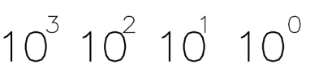

For the binary system the values are assigned as follows: 

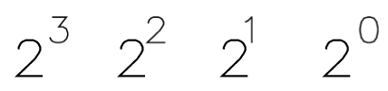

To transform a binary number to a decimal number, the value of each cypher is determined based on its position and summed to the other, for example: 

For the number: 0101 2

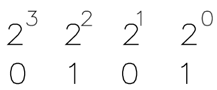

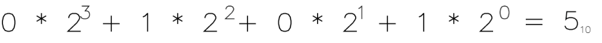

#### Transforming from base 10 to base 2

To explain the procedure, we will be transforming 28 10

The procedure consists of dividing the decimal number by two until the value of the quotient is 1. We will be paying close attention to the value of the reminder as it will be used further on to determine the value of the binary number.

Procedure: 

Once we have reached the quotient with value 1, we order the values of the reminders from last lo first. 
### Hexadecimal System

This numerical system is also useful for computer science. Therefore, this system and the transformation from binary to hexadecimal will be explained.

The hexadecimal system is a positional system, and it is composed of 16 cyphers: 0, 1, 2, 3, 4, 5, 6, 7, 8, 9, A, B, C, D, E, F. In comparison to the decimal system, the cyphers A to F represent the decimal numbers: A = 10, B = 11, C = 12, D = 13, E = 14, F = 15

A number written in hexadecimal would look like: 3E8 16

#### Transforming base 16 to base 10

Take the number 4CE 16

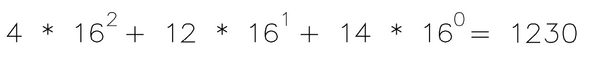

To determine the value in decimal:

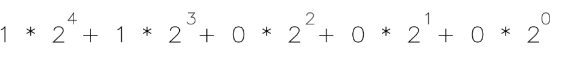

#### Transforming base 16 to base 2

Begin by transforming the number in base 16 to base 10, then transform the number from base 10 to base 2 as already shown.

Take the number: 11000

1. Transform to base 10 

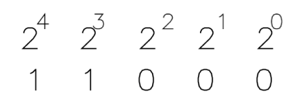

11000 2 = 24 10

2. Transform to base 16
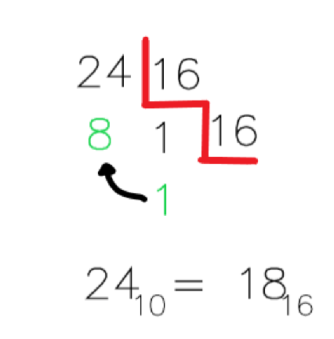
