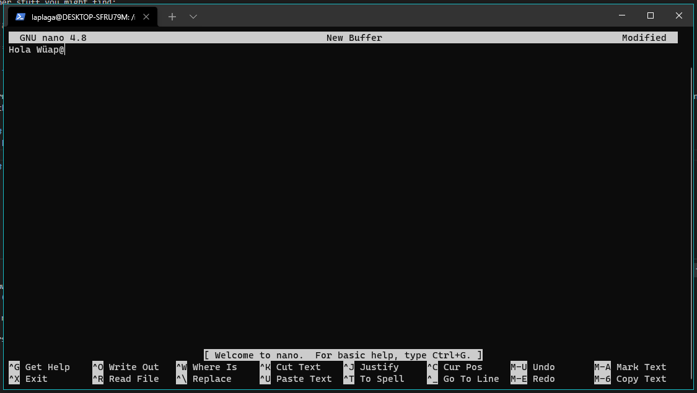
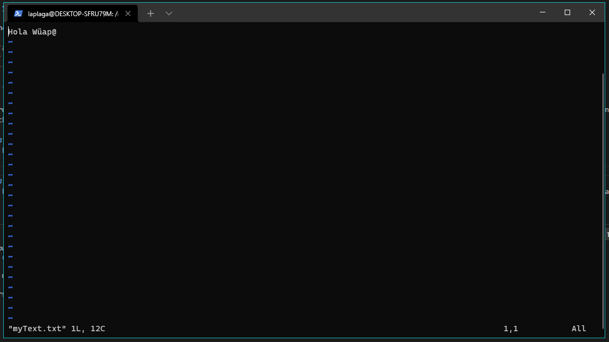

# Terminal

Bu!

Haha probably scared you. 

Don't worry tho, the terminal isn't scarry, it is just missunderstood.

The way the terminal in linux forks is easy: 

1. Type a command.
2. The command might take in arguments, if so add them.
3. Add tags for more things.
4. DuckDuckGo (or Google) a command you don't know.

In the terminal, spaces mean end of command, so if you have to go to a file with spaces, write `first\ second`.

Usefull commands are:
| Command   | Example   | What it does |
|-----------|-----------|--------------|
| `man`     | `man gcc`         | how to use a command, for example man nautilus will bring out all the file mannager info |
| `sudo`    | `sudo anyCommand` | The default run as admin (DO NOT USE UNLESS YOU KNOW WHAT IS HAPPENING) |
| `ssh`     | `ssh -i file.key me@domain.com`| Connecto to other computor | 
| `apt`     | `apt install make`| App installer (can also uninstall and update) | 
| `mkdir`   | `mkdir games`     | Make a directory (new folder)| 
| `rmdir`   | `rmdir games`     | Remove a directory (by default will only delete empty folders, check flags for more options)| 
| `cd`      | `cd ../Documents` | Change Directory| 
| `cat`     | `cat poem.txt`    | Show the contents of file | 
| `grep`    | `grep Robomaster` | Find stuff inside of files or directories| 
| `touch`   | `touch myFile.txt`| Edit files, creates it if it doesn't exist| 
| `wget`    | `wget link.com`   | Download thinks from internet| 

If you want to [move in your file manager](https://ubuntu.com/tutorials/command-line-for-beginners#1-overview)

Other stuff you might find:

- `&&` will literraly run 2 commands, one after the other
- `||` will take the output of one command and shove it into the next
- `*` will replace any amount of letters (for example search for any file that ends in png would be *.png)
- `>` send command output to a file. 
## Text Editors

Terminal text editors, are just like Word but with no interface. They are useful to make quick changes and sometimes the only way to edit files (when connected to a remote machine). There are several of them.  

### Nano
To be honest, [Nano](https://www.nano-editor.org/) is the easiest one to get started with. 

Other links: 
* https://www.howtogeek.com/howto/42980/the-beginners-guide-to-nano-the-linux-command-line-text-editor/

* https://wiki.gentoo.org/wiki/Nano/Basics_Guide

### Vim
It has a learning curve of it's own. You can get better at it with the help of [This site](https://www.openvim.com/), or by typing `vimtutorial` in a Linux terminal. 
